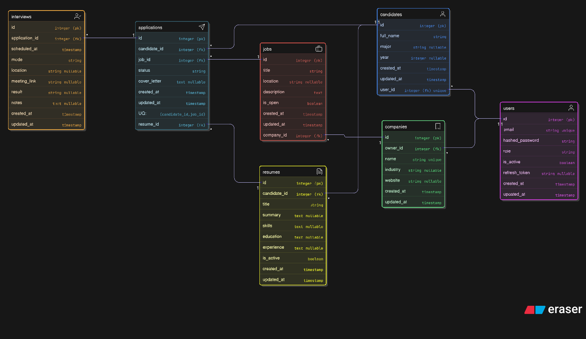

# UniTalent Recruitment API (FastAPI + Neon)

## 1) Project overview
UniTalent Recruitment API is a RESTful backend service for a university-oriented recruitment platform.  
The system supports user authentication, role-based authorization, company and job management, candidate profiles and resumes, job applications, and interview scheduling.

The platform is designed for three main roles:

- **Candidate** — registers, creates a personal profile, manages resumes, applies to jobs, and views own interviews.
- **Recruiter** — creates and manages companies, publishes jobs for owned companies, reviews applications for owned jobs, and manages interviews.
- **Admin** — has full access to all entities and actions.

The API is implemented with a modular FastAPI structure and async database access.  
Authentication and authorization are integrated into the business logic, and database schema changes are managed with Alembic migrations.

---

## 2) Tech stack
- **FastAPI** — web framework
- **SQLModel** — ORM and schema modeling
- **AsyncSession** — asynchronous DB access
- **PostgreSQL (Neon)** — database
- **asyncpg** — PostgreSQL driver
- **Alembic** — database migrations
- **JWT authentication** — access and refresh tokens
- **Redis blocklist** — revoked access token storage after logout
- **Role-based authorization** — candidate / recruiter / admin
- **Custom exception handling** — structured business and validation errors

---

## 3) Entities (7)

### 3.1 User
Stores authentication and account data.

Main purpose:
- registration
- login
- role assignment
- token-based authentication
- account activation status

### 3.2 Candidate
Stores a candidate profile linked to one user account.

Main purpose:
- personal profile information
- candidate identity in the recruitment flow

### 3.3 Company
Stores company information owned by a recruiter or admin.

Main purpose:
- employer organization profile
- parent entity for jobs

### 3.4 Job
Stores a job posting created under a company.

Main purpose:
- open/closed vacancy
- target entity for candidate applications

### 3.5 Resume
Stores a candidate resume.

Main purpose:
- reusable application document
- linked to candidate
- used when applying to jobs

### 3.6 Application
Stores a candidate’s application to a job using a selected resume.

Main purpose:
- connect candidate + job + resume
- track application status
- store cover letter

### 3.7 Interview
Stores interview scheduling and outcome information for an application.

Main purpose:
- interview planning
- interview mode and logistics
- result and notes

---

## 4) Relationships

### 4.1 Main relationships
- **User (1) — (0..1) Candidate**  
  `candidates.user_id -> users.id`

- **User (1) — (N) Company**  
  `companies.owner_id -> users.id`

- **Candidate (1) — (N) Resume**  
  `resumes.candidate_id -> candidates.id`

- **Company (1) — (N) Job**  
  `jobs.company_id -> companies.id`

- **Candidate (1) — (N) Application**  
  `applications.candidate_id -> candidates.id`

- **Job (1) — (N) Application**  
  `applications.job_id -> jobs.id`

- **Resume (1) — (N) Application**  
  `applications.resume_id -> resumes.id`

- **Application (1) — (N) Interview**  
  `interviews.application_id -> applications.id`

### 4.2 Important constraints
- `users.email` is unique
- `candidates.user_id` is unique
- `companies.name` is unique
- `applications(candidate_id, job_id)` is unique

---

## 5) Roles and authorization

The system uses three roles:

### 5.1 Candidate
A candidate can:
- register and log in
- create one own candidate profile
- view, update, and delete own candidate profile
- create, update, and delete own resumes
- apply to open jobs using own resume
- view own applications
- update own application cover letter where allowed
- view interviews related to own applications

### 5.2 Recruiter
A recruiter can:
- register and log in
- create companies and become their owner
- view, update, and delete only owned companies
- create, update, and delete jobs only for owned companies
- view applications only for owned jobs
- update application status only for owned jobs
- create, update, and delete interviews only for applications to owned jobs
- view interviews related to owned jobs

### 5.3 Admin
An admin can:
- access all entities
- perform all actions without ownership limitations
- manage all companies, jobs, applications, interviews, candidates, and resumes

### 5.4 Public access
Some endpoints are public and do not require authentication:
- `GET /`
- `GET /companies`
- `GET /companies/{id}`
- `GET /companies/{id}/jobs`
- `GET /jobs`
- `GET /jobs/{id}`
- `GET /candidates/{id}`
- `GET /resumes`
- `GET /resumes/{id}`

---

## 6) Authentication

The API includes JWT-based authentication with access and refresh tokens.

### 6.1 Register
Users can register with:
- email
- password
- role (`candidate`, `recruiter`, or `admin`)

### 6.2 Login
Users log in with valid credentials and receive:
- `access_token`
- `refresh_token`

### 6.3 Refresh token
A valid refresh token can be used to generate a new pair of access and refresh tokens.

### 6.4 Logout
On logout:
- the current access token is added to Redis blocklist
- the stored refresh token is cleared from the database

### 6.5 Current user
Authenticated users can call:
- `GET /auth/me`

### 6.6 Token revocation
If a revoked access token is used on a protected endpoint, the request is denied.

### 6.7 Inactive users
Inactive users cannot successfully authenticate and access protected functionality.

---

## 7) Functional requirements (User Stories)

## 7.1 Auth / User

**User — Register — User**  
As a User, I can register with email, password, and role (`candidate`, `recruiter`, `admin`).

**User — Login — User**  
As a User, I can log in and receive access and refresh tokens.

**User — Refresh tokens — User**  
As a User, I can refresh my access token using a valid refresh token.

**User — Logout — User**  
As a User, I can log out so that my access token is revoked and my refresh token is cleared.

**User — View current profile — User**  
As an authenticated User, I can call `GET /auth/me` to view my account data.

---

## 7.2 Candidate

**Candidate — Create candidate profile — Candidate**  
As a Candidate, I can create my candidate profile.

**Candidate — View own profile — Candidate**  
As a Candidate, I can view my own candidate profile.

**Candidate — Update own profile — Candidate**  
As a Candidate, I can update my own candidate profile.

**Candidate — Delete own profile — Candidate**  
As a Candidate, I can delete my own candidate profile.

**Candidate — Create resume — Candidate**  
As a Candidate, I can create my own resume.

**Candidate — Update own resume — Candidate**  
As a Candidate, I can update my own resume.

**Candidate — Delete own resume — Candidate**  
As a Candidate, I can delete my own resume.

**Candidate — Apply to job — Candidate**  
As a Candidate, I can apply to an open job using one of my own resumes.

**Candidate — View own applications — Candidate**  
As a Candidate, I can view my own applications list.

**Candidate — Update own application cover letter — Candidate**  
As a Candidate, I can update the cover letter of my own application where allowed.

**Candidate — Delete own application — Candidate**  
As a Candidate, I can delete my own application if business rules allow it.

**Candidate — View own interviews — Candidate**  
As a Candidate, I can view interviews related to my own applications.

---

## 7.3 Recruiter

**Recruiter — Create company — Recruiter**  
As a Recruiter, I can create a company and become its owner.

**Recruiter — View owned company — Recruiter**  
As a Recruiter, I can view my owned company details.

**Recruiter — Update owned company — Recruiter**  
As a Recruiter, I can update my own company.

**Recruiter — Delete owned company — Recruiter**  
As a Recruiter, I can delete my own company if it has no jobs.

**Recruiter — Create job for owned company — Recruiter**  
As a Recruiter, I can create a job for my own company.

**Recruiter — Update owned job — Recruiter**  
As a Recruiter, I can update a job belonging to my own company.

**Recruiter — Delete owned job — Recruiter**  
As a Recruiter, I can delete a job belonging to my own company if it has no applications.

**Recruiter — View job applications — Recruiter**  
As a Recruiter, I can view applications for jobs owned by me.

**Recruiter — Update application status — Recruiter**  
As a Recruiter, I can update the status of applications for my own jobs using valid status transitions.

**Recruiter — Delete application for owned job — Recruiter**  
As a Recruiter, I can delete an application for my own job if business rules allow it.

**Recruiter — Create interview — Recruiter**  
As a Recruiter, I can create an interview for an application to my own job.

**Recruiter — Update interview — Recruiter**  
As a Recruiter, I can update an interview related to my own job’s application.

**Recruiter — Delete interview — Recruiter**  
As a Recruiter, I can delete an interview related to my own job’s application.

**Recruiter — View interviews for owned jobs — Recruiter**  
As a Recruiter, I can view interviews related to applications for my own jobs.

---

## 7.4 Admin

**Admin — Full access — Admin**  
As an Admin, I can access and manage all entities and actions without ownership restrictions.

---

## 7.5 Public

**Public — View root endpoint — Anyone**  
As anyone, I can access `GET /`.

**Public — View companies — Anyone**  
As anyone, I can view the companies list and company details.

**Public — View company jobs — Anyone**  
As anyone, I can view jobs of a selected company.

**Public — View jobs — Anyone**  
As anyone, I can view the jobs list and job details.

**Public — View candidate by id — Anyone**  
As anyone, I can view a candidate profile by id.

**Public — View resumes — Anyone**  
As anyone, I can view the resumes list and resume details.

---

## 8) Authentication scenarios

### 8.1 Register
- `POST /auth/register` with valid email, password, and role returns **201**
- registration with duplicate email returns **409**

### 8.2 Login
- `POST /auth/login` with valid credentials returns **200** and tokens
- invalid credentials return **401**
- inactive user returns **401**

### 8.3 Refresh
- `POST /auth/refresh` with valid refresh token returns **200** and a new token pair
- invalid refresh token returns **401**
- expired refresh token returns **401**
- wrong token type returns **401**

### 8.4 Logout
- `POST /auth/logout` with valid Bearer token returns **204**
- access token is blocklisted in Redis
- refresh token is removed from DB

### 8.5 Revoked token
- using the same revoked access token on a protected route returns **401**
- error meaning: token has been revoked

### 8.6 Current user
- `GET /auth/me` with valid token returns current authenticated user
- `GET /auth/me` without token or with invalid token returns **401**

---

## 9) Authorization scenarios

### 9.1 Public endpoints
These endpoints are accessible without token:
- `GET /`
- `GET /companies`
- `GET /companies/{id}`
- `GET /companies/{id}/jobs`
- `GET /jobs`
- `GET /jobs/{id}`
- `GET /candidates/{id}`
- `GET /resumes`
- `GET /resumes/{id}`

### 9.2 Candidate-only actions
Candidate-specific actions include:
- create candidate profile
- create/update/delete own resumes
- create own applications
- update own application cover letter
- view own applications and related interviews

If a recruiter or another unauthorized role tries to perform candidate-only actions, access is denied with **403** where enforced.

### 9.3 Recruiter ownership rules
A recruiter can:
- update/delete only own companies
- create jobs only for own companies
- update/delete only own jobs
- view applications only for own jobs
- update application status only for own jobs
- create/update/delete interviews only for applications to own jobs

If a recruiter tries to manage another recruiter’s company, job, application, or interview, access is denied with **403**.

### 9.4 Candidates list access
`GET /candidates` is not public for all roles.  
It is available only to **admin** and **recruiter** where role checks are enforced.  
A candidate user trying to access the full candidates list receives **403**.

### 9.5 Admin access
Admin can access all protected resources and perform all operations without ownership restrictions.

---

## 10) Business rules and edge cases

### 10.1 Authentication and account rules
- duplicate email during registration returns **409**
- invalid credentials return **401**
- inactive user cannot log in and access protected routes
- revoked access token returns **401**

### 10.2 Candidate rules
- one user can create only one candidate profile
- creating a second candidate profile for the same user returns **409**
- candidate can edit and delete only own candidate profile

### 10.3 Company rules
- company name must be unique
- duplicate company name returns **409**
- recruiter can update/delete only own company
- deleting a company that has jobs returns **400**

### 10.4 Job rules
- creating a job for a non-existent company returns **404**
- recruiter cannot create a job for another user’s company and receives **403**
- deleting a job that has applications returns **400**

### 10.5 Application rules
- candidate can apply only to open jobs
- applying to a closed job returns **400**
- one candidate can apply to the same job only once
- duplicate application returns **400**
- candidate can apply only with own resume
- using another candidate’s resume returns **403**
- candidate cannot change application status directly and receives **403**
- candidate may update only allowed own fields such as cover letter
- deleting an application that has interviews returns **400**

### 10.6 Application status transition rules
Valid transitions:
- `submitted -> reviewing`
- `submitted -> rejected`
- `reviewing -> accepted`
- `reviewing -> rejected`

Invalid transitions:
- `accepted -> ...` not allowed
- `rejected -> ...` not allowed

Invalid transition returns **400**.

### 10.7 Interview rules
- interview cannot be created for a rejected application
- creating an interview for a rejected application returns **400**
- if `mode = online`, `meeting_link` is required
- if `mode = offline`, `location` is required
- invalid interview mode data returns **400**
- recruiter can create/update/delete interviews only for own job’s applications
- candidate can only view own interviews

---

## 11) ERD

The final ERD reflects the implemented database schema with 7 entities:

- User
- Candidate
- Company
- Job
- Resume
- Application
- Interview

### ERD workspace
`https://app.eraser.io/workspace/NB6doPv3jrWyH6IOifoO?origin=share`

### ERD image preview

### ERD code
[Download / view ERD code](./assets/erd.txt)