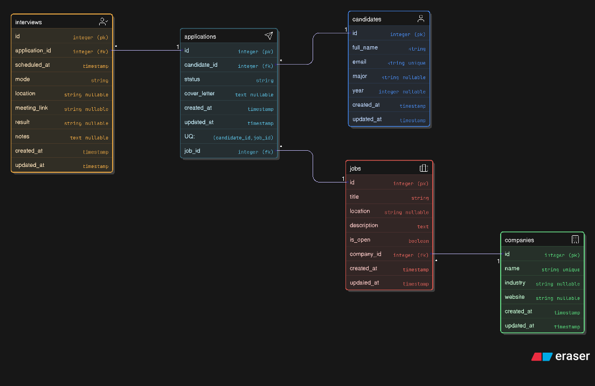

# Assignment 3 — UniTalent Recruitment API (FastAPI + Neon)

## 1) Project overview
UniTalent Recruitment API is a REST service for a recruitment workflow:
companies create job listings, candidates create profiles and apply for jobs, and recruiters schedule interviews.

Tech:
- FastAPI
- SQLModel ORM + AsyncSession
- PostgreSQL on Neon
- No authentication

---

## 2) Entities (5)
1. **Candidates**
2. **Companies**
3. **Jobs**
4. **Applications**
5. **Interviews**

---

## 3) Relationships 
- **Company (1) — (N) Job**  
  `jobs.company_id -> companies.id`
- **Candidate (1) — (N) Application**  
  `applications.candidate_id -> candidates.id`
- **Job (1) — (N) Application**  
  `applications.job_id -> jobs.id`
- **Application (1) — (N) Interview**  
  `interviews.application_id -> applications.id`

Constraints:
- **Application UNIQUE(candidate_id, job_id)** — one candidate can apply to the same job only once.

Performance:
- Relationships use `lazy="selectin"` to avoid N+1 queries.

---

## 4) Business rules
### POST /applications
When creating an application, the system must ensure:
1) `candidate_id` exists  
2) `job_id` exists  
3) `job.is_open == true`  
4) No duplicate `(candidate_id, job_id)` applications

---

## 5) CRUD endpoints checklist (per entity)
Each entity supports:
- **GET** list (with `skip`, `limit`)
- **GET** by id
- **POST** create
- **PUT** replace (full update)
- **PATCH** partial update
- **DELETE** remove

Filters:
- **Jobs**: `search`, `is_open`, `company_id`
- **Applications**: `candidate_id`, `job_id`, `status`
- **Interviews**: `application_id`

List of endpoints:

### Root
- **GET /** — health/root message

### Candidates (`/candidates`)
- **GET /candidates** — list (skip, limit)
- **GET /candidates/{candidate_id}** — get by id
- **POST /candidates** — create
- **PUT /candidates/{candidate_id}** — replace
- **PATCH /candidates/{candidate_id}** — partial update
- **DELETE /candidates/{candidate_id}** — delete
- **GET /candidates/{candidate_id}/applications** — list candidate’s applications

### Companies (`/companies`)
- **GET /companies** — list (skip, limit)
- **GET /companies/{company_id}** — get by id
- **POST /companies** — create
- **PUT /companies/{company_id}** — replace
- **PATCH /companies/{company_id}** — partial update
- **DELETE /companies/{company_id}** — delete
- **GET /companies/{company_id}/jobs** — list company’s jobs

### Jobs (`/jobs`)
- **GET /jobs** — list (skip, limit, search, is_open, company_id)
- **GET /jobs/{job_id}** — get by id
- **POST /jobs** — create
- **PUT /jobs/{job_id}** — replace
- **PATCH /jobs/{job_id}** — partial update
- **DELETE /jobs/{job_id}** — delete
- **GET /jobs/{job_id}/applications** — list job’s applications

### Applications (`/applications`)
- **GET /applications** — list (skip, limit, candidate_id, job_id, status)
- **GET /applications/{app_id}** — get by id
- **POST /applications** — create (with business rules)
- **PUT /applications/{app_id}** — replace (full)
- **PATCH /applications/{app_id}** — partial update
- **DELETE /applications/{app_id}** — delete
- **GET /applications/{app_id}/interviews** — list interviews for application

### Interviews (`/interviews`)
- **GET /interviews** — list (skip, limit, application_id)
- **GET /interviews/{interview_id}** — get by id
- **POST /interviews** — create
- **PUT /interviews/{interview_id}** — replace (full)
- **PATCH /interviews/{interview_id}** — partial update
- **DELETE /interviews/{interview_id}** — delete
---

## 6) Functional requirements (User Stories)

### 6.1 Candidate
**Candidate — Create profile — Candidate**  
As a Candidate, I can create my profile.

**Candidate — View profile — Candidate**  
As a Candidate, I can view my profile details.

**Candidate — Update profile — Candidate**  
As a Candidate, I can update my profile information.

**Candidate — Delete profile — Candidate**  
As a Candidate, I can delete my profile.

**Candidate — View own applications — Candidate**  
As a Candidate, I can view all applications I have submitted.

---

### 6.2 Company
**Company — Create company — Company Admin**  
As a Company Admin, I can create a company profile.

**Company — View company — User**  
As a User, I can view company details.

**Company — Update company — Company Admin**  
As a Company Admin, I can update company information.

**Company — Delete company — Company Admin**  
As a Company Admin, I can delete a company profile.

**Company — View company jobs — User**  
As a User, I can view all jobs posted by a company.

---

### 6.3 Job
**Job — Create job — Company Admin**  
As a Company Admin, I can create a job listing for my company.

**Job — View job — Candidate**  
As a Candidate, I can view job details.

**Job — Update job — Company Admin**  
As a Company Admin, I can update a job listing.

**Job — Close/Open job — Company Admin**  
As a Company Admin, I can close or reopen a job by changing `is_open`.

**Job — Search jobs — Candidate**  
As a Candidate, I can search and filter jobs by title, company, and open status.

**Job — View job applications — Recruiter**  
As a Recruiter, I can view applications submitted for a specific job.

---

### 6.4 Application
**Application — Apply to job — Candidate**  
As a Candidate, I can apply to an open job.

**Application — Prevent duplicate apply — System**  
As a System, I prevent duplicate applications for the same candidate and job.

**Application — View application — Candidate/Recruiter**  
As a User, I can view application details by id.

**Application — Update application (replace) — Recruiter**  
As a Recruiter, I can fully replace application data using PUT.

**Application — Update application (partial) — Recruiter**  
As a Recruiter, I can partially update application fields (status/cover letter) using PATCH.

**Application — Filter applications — Recruiter**  
As a Recruiter, I can filter applications by candidate, job, and status.

**Application — Delete application — Recruiter**  
As a Recruiter, I can delete an application.

**Application — View application interviews — Recruiter**  
As a Recruiter, I can view all interviews linked to an application.

---

### 6.5 Interview
**Interview — Schedule interview — Recruiter**  
As a Recruiter, I can schedule an interview for an application.

**Interview — View interview — Recruiter**  
As a Recruiter, I can view interview details.

**Interview — Update interview (replace) — Recruiter**  
As a Recruiter, I can fully replace interview details using PUT.

**Interview — Update interview (partial) — Recruiter**  
As a Recruiter, I can partially update interview details using PATCH.

**Interview — Filter interviews — Recruiter**  
As a Recruiter, I can list interviews filtered by application.

**Interview — Delete interview — Recruiter**  
As a Recruiter, I can delete an interview.

---

## 7) ERD export (eraser.io)

https://app.eraser.io/workspace/NB6doPv3jrWyH6IOifoO?origin=share

### ERD image preview

---

### ERD code (txt)
[Download / view ERD code](./assets/erd.txt)

